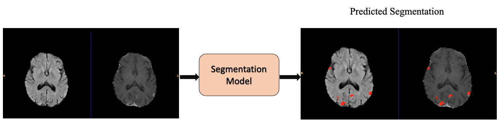
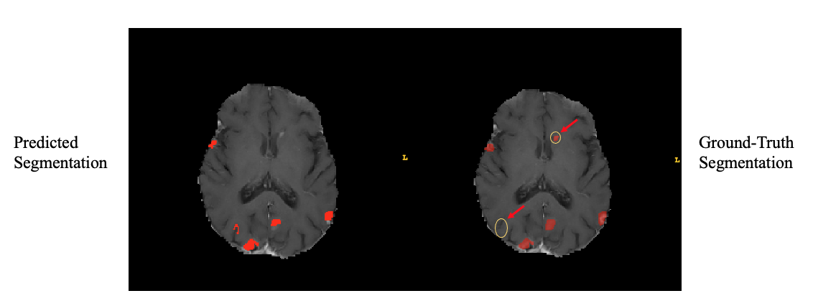
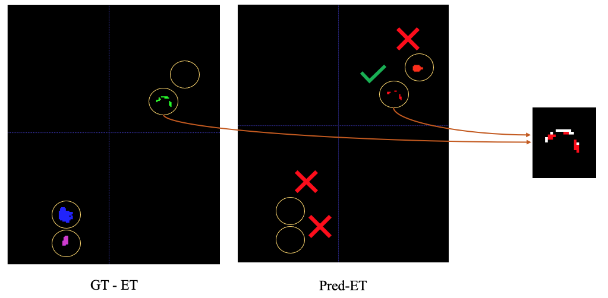
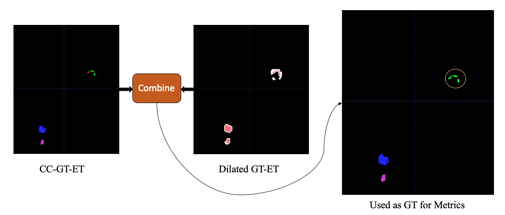

# BraTS 2023 Lesion-Wise Performance Metrics for Segmentation Challenges

## Outline

Thank you all for participating in this year's BraTS Challenge. 

This year we are introducing 2 new performance metrics called lesion-wise dice score and lesion-wise Hausdorff distance-95 (HD95). This is mainly developed to understand the performance of a model at a lesion level and not at an image level. By evaluating models lesion-by-lesion we can understand how well models catch and segment abnormalities, and doesn't bias the results in favor of models that capture only large lesions. 

Below is an outline of how we perform this analysis - 

1.  First, we isolate the Lesion Tissues into WT; TC and ET.
2.  We perform a dilation on the Ground Truth (GT) labels (for WT; TC and ET) to understand the extent of the lesion. This is mainly done so that when we do connected component analysis; we don't classify small lesions near an "actual" lesion as a new one. An important thing to note is that the GT labels doesn't change in the process.
3.  We perform connected component analysis on the Prediction label and compare it component by component to the GT label.
4.  We calculate dice scores and HD95 scores for each lesion (or component) individually and we penalize all the False Positives and the False Negatives with a 0 score. Then, we take the mean for the particular CaseID.
5.  Each challenge leader has set a volumetric threshold, below which participants' models won't be evaluated for those "small/false" lesions.

## Intuition 

First, let’s take a pair of MR images that are FLAIR and T1Post Contrast. We assume that we have segmentation model that can segment the lesions for these pair of images. 
On the right we have the predicted segmentations by the model. 

Now, let’s analyze the predicted segmentation against the ground truth further. For simplicity we compare the lesions on the T1Post image.  So, while comparing we see that the Predicted segmentation has some differences against the ground truth. The key differences is that - 
1. It completely missed a lesion, which is very important for some pathologies. 
2. It also predicted a lesions  or a False Positive, which the model should be penalized for in segmentation tasks. 

So, what we really want to emphasize here is that 
1. We want to penalize models that miss lesions all together since they could be clinically crucial.
2. We also want to penalize the model if it produces false positive lesions, because the legacy dice score don’t cater to that problem.
3. An important thing to note is that legacy dice scores tend to higher for larger lesions, hence, could produce inflated dice scores, while missing lesions.
4. HD95 don’t produce meaningful insights in a multi-lesion setting.

## Methodology

On the left we have the ground truth and on the right we have the predictions. We perform a connected component analysis on the prediction mask and compare it component by component to the GT mask after combing lesions by dilation.
Now we compare each component one-by-one, and we see here that the model has missed 2 lesions below and has produced a false positive. It has produced one lesion that overlaps with the true lesion from the ground truth mask, so we calculate metrics for that. 

To ensure we get the right number of GT lesions we first perform a dilation on the GT mask, we combine the components that exists within the region of interest of the Dilated Component. The way we do that is we perform a 26-connectivity 3D connected component on the Dilated Mask as well, and use that to combine lesions within that ROI. So, on the left here we have the 4 components in Enhancing tissue,  On the right we have the dilated Ground truth Enhancing tissue. Now, to get the right number of ground truth lesions we combine these two and see if multiple components fall into a single Dilated ROI.

We see here that the 2 components on the upper right side really belong to just one lesion, so we count that as one lesion for our analysis hence yielding a total of 3 lesions instead of 4. in the Enhancing Tissue. We use this as the ground truth for our comparison against the model predictions. 

To formalize the mathematical formula. It is basically summation of dice and HD95 divided by sum of the number of TP; FP and FN. Same is done for HD95, Here L is the number of GT lesions that we calculate after dilation.

$$ \text{Lesion-wise Dice Score} = \frac{ \textstyle \sum_{i}^{L} Dice(l_i)}{TP + FN + FP}$$

$$ \text{Lesion-wise HD95} = \frac{ \textstyle \sum_{i}^{L} HD_{95}(l_i)}{TP + FN + FP}$$

 
